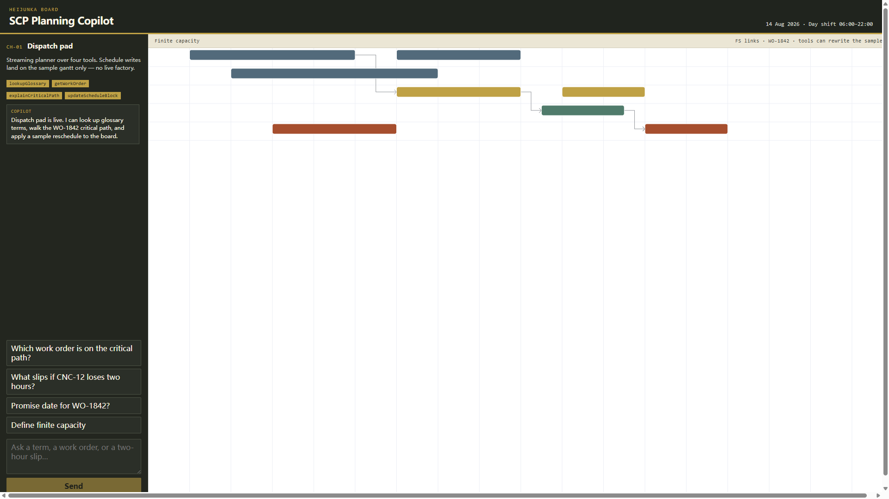
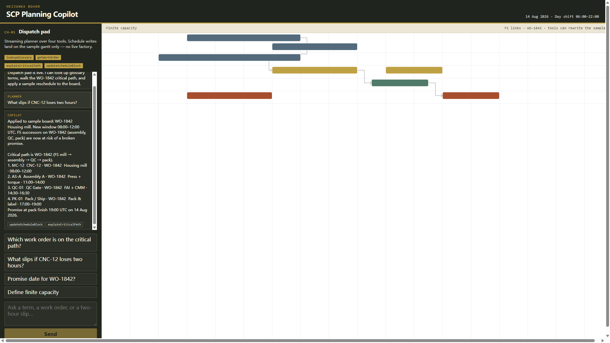
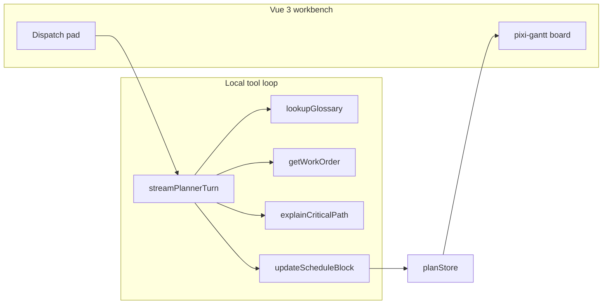

# SCP Planning Copilot

Vue 3 workbench for **finite-capacity supply chain planning**: a [pixi-gantt](https://github.com/mizuno0237/pixi-gantt) resource board plus a streaming dispatch-pad copilot.

A planner asks in English. The pad calls typed tools. Writes land on the sample gantt — not a live factory.

[](LICENSE)

**Public sprint** · D1–D3 (08-14 → 08-16) · About paste: [`docs/GITHUB-ABOUT.md`](docs/GITHUB-ABOUT.md)



## Quick start

```bash
# sibling of pixi-gantt (Vite aliases the library source until it is on npm)
cd GitHub-project/scp-planning-copilot
npm install
npm run dev
```

Open http://localhost:5175

No API key. The pad streams a local tool-loop planner so the demo runs offline.

`pixi-gantt` is not on the npm registry yet. This app resolves it from `../pixi-gantt/src` via the Vite alias in `vite.config.ts`. After `npm publish` of pixi-gantt, switch the dependency to the registry package.

## Demo walkthrough

1. Open the board. Five lanes (CNC-12, CNC-18, Assembly A, QC, Pack) and FS links on **WO-1842**.
2. Click **Which work order is on the critical path?** — `explainCriticalPath` walks mill → assembly → QC → pack.
3. Click **What slips if CNC-12 loses two hours?** — `updateScheduleBlock` stretches the mill; the gantt redraws; successors are flagged.
4. Click **Define finite capacity** — `lookupGlossary` returns the shop-floor definition used on this board.



Type `reset the plan` to restore the 14 Aug 06:00 baseline.

## Architecture



The loop shape matches Vercel AI SDK tool calling (tool → result → stream). Swap `streamPlannerTurn` for `@ai-sdk/vue` when you have a hosted model. Full write-up: [`docs/ARCHITECTURE.md`](docs/ARCHITECTURE.md).

| Piece | Path |
| --- | --- |
| Dispatch pad | `src/components/ChatPanel.vue` |
| Gantt host | `src/components/PlanningGantt.vue` |
| Tool loop | `src/lib/streamPlanner.ts` |
| Planning tools | `src/tools/planningTools.ts` |
| Sample Heijunka plan | `src/data/samplePlan.ts` |

## Planning tools

| Tool | What it does |
| --- | --- |
| `lookupGlossary` | WO / FS / ATP / bottleneck / Heijunka / FAI |
| `getWorkOrder` | Operations and UTC windows for a WO |
| `explainCriticalPath` | FS chain mill → assembly → QC → pack |
| `updateScheduleBlock` | Shift or stretch a block; gantt redraws |

## Sample board

Day shift **14 Aug 2026, 06:00–22:00 UTC**. Critical path is **WO-1842**:

1. CNC-12 housing mill
2. Assembly A press + torque
3. QC FAI + CMM
4. Pack & label

Three FS links. Stretching the mill does not create a second CNC — downstream promise risk is the point of the demo.

## License

MIT
