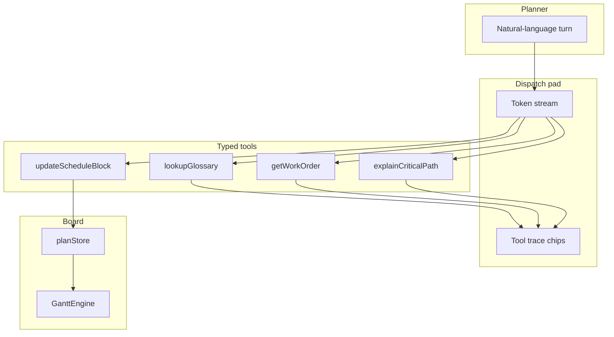

# Architecture

The copilot is a **tool loop over a sample finite-capacity plan**, not a chat wrapper around a factory API.

## Why this shape

A planning question is only useful if it can **name a work order, walk FS links, and rewrite a block**. Those are tools. The model (or the local router that stands in for one) chooses a tool; the board is the source of truth.

| Layer | Responsibility |
| --- | --- |
| `streamPlannerTurn` | Route the turn, emit tool events, stream text |
| `planningTools` | Pure reads/writes against `planStore` |
| `planStore` | In-memory `GanttModel` + revision signal |
| `PlanningGantt` | Mounts `pixi-gantt` and repaints on revision |

## Offline demo vs hosted model

D3 ships a **local router** so `npm run dev` works without a key. Prompt patterns map to tools (`slips` / `loses` → `updateScheduleBlock`, glossary terms → `lookupGlossary`).

The event types (`tool` then `text`) match a Vercel AI SDK `ToolLoopAgent` turn. To point the pad at a hosted model, replace `streamPlannerTurn` and keep the same four tool implementations.

## Sample model

`createSamplePlan()` builds five resource lanes and eight operations. WO-1842 is the only FS chain. `applyBlockChangeToModel` from pixi-gantt applies a write; successors are **not** auto-shifted — the copilot reports the broken-promise risk instead. That is intentional: finite capacity is a constraint, not a solver in this snapshot.
